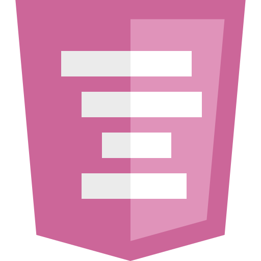

<div align="center">
  
  <h1>Indented CSS (ICSS)</h1>
  <p>A modern, lightweight, indentation-based syntax for CSS compiled with high-performance Rust.</p>

  [](https://opensource.org/licenses/MIT)
</div>

---

**Indented CSS (ICSS)** brings the simplicity and elegance of indentation-based syntax (brace-free, semicolon-free) to standard CSS. It is powered by a high-performance compiler written in Rust, which can be run as a CLI or compiled to WebAssembly to integrate seamlessly into modern JS build systems like Vite.

## Table of Contents

- [Features](#features)
- [Syntax Example](#syntax-example)
- [Project Structure](#project-structure)
- [Getting Started](#getting-started)
  - [Rust CLI & Compiler](#rust-cli--compiler)
  - [Node.js SDK](#nodejs-sdk)
  - [Vite Plugin](#vite-plugin)
  - [VS Code Extension](#vs-code-extension)
- [Development & Building](#development--building)
- [License](#license)

---

## Features

- ✨ **Brace-Free & Semicolon-Free**: Cleaner syntax that relies on indentation.
- 📦 **Nesting Support**: Declare nested child selectors easily.
- 🔗 **Parent Reference (`&`)**: Support for pseudo-classes, states, and sibling selectors (e.g. `&:hover`, `&:disabled`, `+ .sibling`).
- 🌐 **At-Rules Support**: Seamless handling of `@media`, `@keyframes`, and other at-rules.
- ⚡ **Rust Engine & WebAssembly**: Super fast builds and ready for both native and web environments.

---

## Syntax Example

### Indented CSS (`style.icss`)
```sass
.main-container
  display: flex
  flex-direction: column
  padding: 20px

  .child-element
    color: red
    margin-top: 10px

    &:hover
      color: blue
      background: yellow

@media (max-width: 800px)
  .main-container
    padding: 10px
```

### Compiled Standard CSS (`style.css`)
```css
.main-container {
  display: flex;
  flex-direction: column;
  padding: 20px;
  .child-element {
    color: red;
    margin-top: 10px;
    &:hover {
      color: blue;
      background: yellow;
    }
  }
}
@media (max-width: 800px) {
  .main-container {
    padding: 10px;
  }
}
```

---

## Project Structure

This monorepo contains the entire Indented CSS ecosystem:

```
icss-lang/
├── icss-rs/               # Core Rust compiler & CLI wrapper
├── node/
│   ├── icss-lang/         # Node.js bindings (@icss-lang/node) compiled with WASM
│   └── vite-plugin/       # Vite integration plugin (@icss-lang/vite-plugin)
└── vscode/                # VS Code extension for syntax highlighting
```

---

## Getting Started

### Rust CLI & Compiler

Compile `.icss` files directly from your terminal using the Rust CLI wrapper.

```bash
# Compile a file and print standard CSS to stdout
cargo run --bin i-css -- path/to/file.icss
```

### Node.js SDK

Add the compiler to your JavaScript/TypeScript project:

```bash
npm install @icss-lang/node
```

```javascript
import { compile_icss } from '@icss-lang/node';

const icss = `
body
  margin: 0
  color: #333
`;

const css = compile_icss(icss);
console.log(css);
```

### Vite Plugin

Compile `.icss` imports on the fly in your Vite project:

```bash
npm install @icss-lang/vite-plugin
```

Add it to your `vite.config.js` or `vite.config.ts`:

```javascript
import { defineConfig } from 'vite';
import { indentedCSS } from '@icss-lang/vite-plugin';

export default defineConfig({
  plugins: [
    indentedCSS()
  ]
});
```

### VS Code Extension

Get full syntax highlighting and language support for `.icss` and `.cssi` files. See the [vscode](file:///Users/joshua/dev/joshua/icss-lang/vscode) folder for configuration and development details.

---

## Development & Building

A master `Makefile` at the root directory helps build and test all workspace packages:

```bash
# Compile the Rust CLI
make icss-rs

# Compile the Rust engine to WebAssembly for the Node package
make icss-rs.wasm

# Run tests
make icss-rs.test
make node/icss-lang.test
make node/vite-plugin.test

# Package the VS Code extension
make icss-language.vsix
```

---

## License

This project is licensed under the MIT License (and ISC for the Vite plugin).
